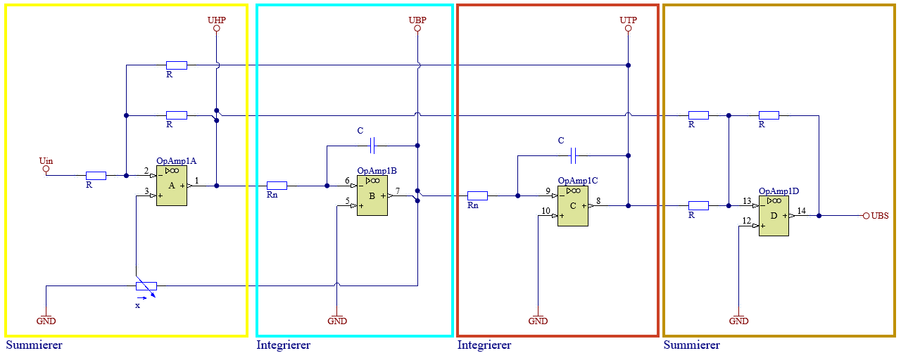
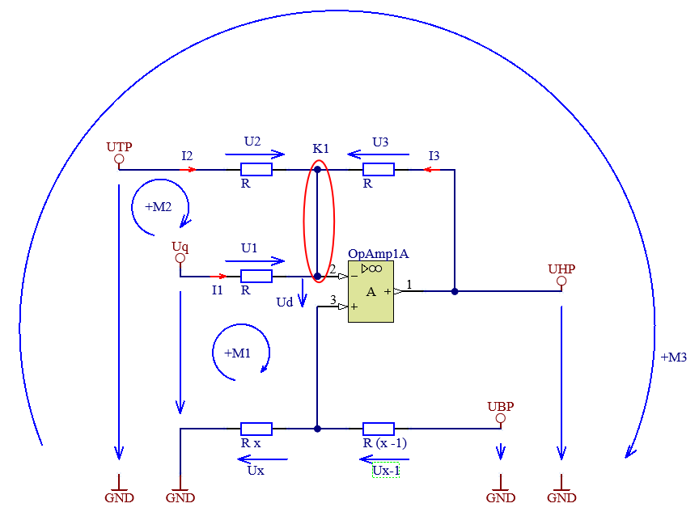
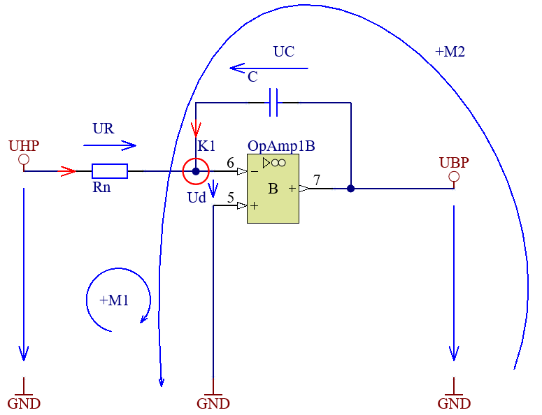
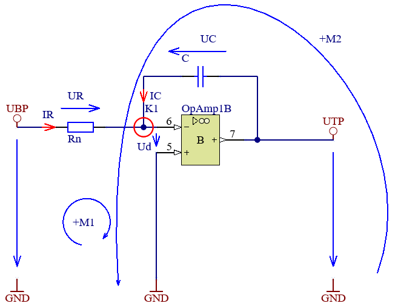
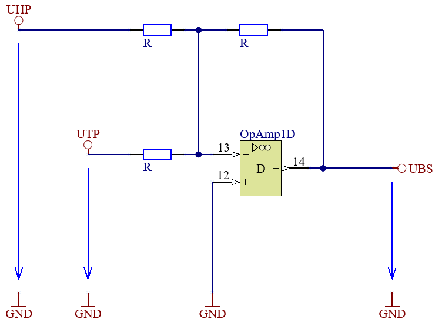

```{python}
#| code-fold: true
##| echo: false
from sympy import *
from sympy.abc import s
from sympy.physics.control.lti import TransferFunction, Series
from sympy.physics.control.control_plots import * #impulse_response_plot, step_response_plot, step_response_numerical_data, bode_plot, pole_zero_plot, step_response_numerical_data

```

# State Variable Filter {#sec-VarStatFilter}  


Filter allgemein werden eingesetzt um Signale zu verarbeiten. Ein Filter kann dabei unterschiedliche Aufgaben übernehmen. Ein Filter kann z.B. dazu verwendet werden, um ein Signal zu glätten, um Störungen zu unterdrücken oder um Signale zu trennen. Filter können dabei unterschiedliche Strukturen aufweisen.  

Der hier vorgestellte *State Variable Filter*, @fig-svf_sch ist ein Filter, welcher mit einer Schaltung sowohl als Tiefpassfilter, Hochpassfilter, Bandpassfilter oder Bandsperre verwendet werden kann. Welcher Filter auf das Eingangssignal angewandt wird, wird durch die Auswahl des Ausganges bestimmt.  

{#fig-svf_sch}  

```{python}
#| code-fold: true
##| echo: false

w = MySymbol('omega',real=True,positive=True,description='Kreisfrequenz',unit=u.rad/u.s)
Uq = MySymbol('U_q',real=False,description='Eingangsspannung',unit=u.V)
UHP = MySymbol('U_HP',real=False,description='Spannung am Hochpass Ausgang',unit=u.V)
UBP = MySymbol('U_BP',real=False,description='Spannung am Bandpass Ausgang',unit=u.V)
UTP = MySymbol('U_TP',real=False,description='Spannung am Tiefpass Ausgang',unit=u.V)
UBS = MySymbol('U_BS',real=False,description='Spannung am Bandsperre Ausgang',unit=u.V)

QBookHelpers.print_description([Uq,UHP,UBP,UTP,UBS])

```

Das Verhalten von Filtern kann am besten mit deren Übertragungsfunktion beschrieben werden. Dabei geht es immer darum, das Verhältnis von Ausgangssignal zu Eingangssignal zu beschreiben. Da sich das Wort Filter auf Frequenzen bezieht, wird die Übertragungsfunktion in der Regel im Frequenzbereich betrachtet. Ob dabei nun die komplexe Schreibweise $j\omega$ oder die Laplace-Transformation $s$ verwendet wird, hängt im Wesentlichen davon ab welche Art von Eingangssignalen betrachtet werden sollen.  

Für den hier gezeigten *State Variable Filter* müssen die Übertragungsfunktionen für die vier möglichen Filtertypen analytisch berechnet werden.  

Die analytisch berechneten Übertragungsfunktionen der Filter werden verwendet, um Bodediagramme zu erstellen. Diese Bodediagramme geben Aufschluss über das Frequenzverhalten des Systems, indem sie die Verstärkung und Phasenverschiebung in Abhängigkeit von der Frequenz darstellen. Im Anschluss an die Berechnung der Bodediagramme auf analytischer Basis erfolgt der Vergleich mit numerischen Simulationsergebnissen, die in *Altium* durchgeführt werden.  

Der Vergleich zwischen analytischen und simulierten Ergebnissen ermöglicht eine Überprüfung der Genauigkeit des mathematischen Modells sowie der Simulationseinstellungen in Altium. Eventuelle Abweichungen können auf Vereinfachungen im analytischen Modell, numerische Fehler oder auf die verwendeten Bauteilparameter in der Simulation zurückzuführen sein.


## Analytische Herleitung der Übertragungsfunktionen {#sec-AnalytischeHerleitungSVF}
Ziel ist es, die Übertragungsfunktion für jeden Filtertyp zu ermitteln. Also immer das Verhältnis von Ausgangsspannung zu Eingangsspannung mathematisch zu beschreiben. Das Ergebnis darf keine abhängigen (unbekannten) Variablen mehr enthalten.
Folgende Gleichungen sind gesucht:

```{python}
#| code-fold: true
##| echo: false

AHP = MySymbol('A_{HP}',real=False,description='Übertragungsfunktion Hochpassfilter')
ABP = MySymbol('A_{BP}',real=False,description='Übertragungsfunktion Bandpassfilter')
ATP = MySymbol('A_{TP}',real=False,description='Übertragungsfunktion Tiefpassfilter')
ABS = MySymbol('A_{BS}',real=False,description='Übertragungsfunktion Bandsperrfilter')

display(Markdown("Übertragungsfunktion Hochpassfilter:"))
eqAP = Eq(AHP,UHP/Uq)
QBookHelpers.print_equation(eqAP, label='eq-AP')

display(Markdown("Übertragungsfunktion Bandpassfilter:"))
eqBP = Eq(ABP,UBP/Uq)
QBookHelpers.print_equation(eqBP, label='eq-BP')

display(Markdown("Übertragungsfunktion Tiefpassfilter:"))
eqTP = Eq(ATP,UTP/Uq)
QBookHelpers.print_equation(eqTP, label='eq-TP')

display(Markdown("Übertragungsfunktion Bandsperrfilter:"))
eqBS = Eq(ABS,UBS/Uq)
QBookHelpers.print_equation(eqBS, label='eq-BS')


```

Um die Komplexität zu reduzieren wird die Schaltung in möglichst einfache Teilschaltungen zerlegt.  
Hier bietet sich die an, die Schaltung rund um die Operationsverstärker und deren jeweiliger Beschaltung zu betrachten.  
Damit die Übertragungsfunktionen der Teilschaltungen berechnet werden können müssen die Eingangsspannungen der Teilschaltungen zunächst als bekannt angenommen werden.  
Die Teilübertragungsfunktionen ergeben ein Gleichungssystem welches im Anschluss gelöst werden muss um die gesuchten Übertragungsfunktionen ohne unbekannte Variablen zu erhalten.  

### Summierer am Eingang
Der erste Operationsverstärker in der Schaltung fungiert als invertierender Summierer. Wird die Schaltung umgezeichnet ist der Summierer gut erkennbar. Einzige Besonderheit ist die Offsetspannung am positiven Eingang.  
Statt die Gleichungen für den Summierer anzupassen um die Übertragungsfunktion zu erhalten, wird die Übertragungsfunktion hergeleitet.  

{#fig-Eingangssummierer}  

Das Potentiometer wurde für die Herleitung aufgeteilt, damit der Spannungsteiler besser dargestellt werden kann. $x$ ist dabei der einstellbare Anteil des Potentiometers. Die Herleitung wird nach dem verfahren der Knoten- Spannungsanalysen, @sec-KonoSpannungsanalyse durchgeführt. Allerdings wird nicht jeder Schritt im Detail gezeigt.  

Da die Spannung $U_{HP}$ der Ausgang des Summierers ist, wird diese Spannung als Ausgang behandelt. Es ist also die Übertragungsfunktion $A_{HP} = \frac{U_{HP}}{U_{q}}$ zu ermitteln. Als bekannt gilt die Eingangsspannung $U_q$, die Position des Potentiometers $x$ und der Widerstandswert $R$. Weiters wird für diesen Schritt die Spannung $U_{TP}$ und $U_{BP}$ als bekannt angenommen. 

Im ersten Schritt werden die Knoten- und Maschengleichungen aufgestellt:

```{python}
#| code-fold: true
##| echo: false

R = MySymbol('R',real=True,positive=True,description='Widerstandswert',unit=u.ohm)
Ud = MySymbol('U_d',real=False,description='Offset Spannung',unit=u.V)
Ux = MySymbol('U_x',real=False,description='Spannung am Potentiometer Abgriff',unit=u.V)
Ux1 = MySymbol('U_{x-1}',real=False,description='Spannung am Potentiometer oberen Ende',unit=u.V)
U1 = MySymbol('U_1',real=False,description='Spannung 1',unit=u.V)
U2 = MySymbol('U_2',real=False,description='Spannung 2',unit=u.V)
U3 = MySymbol('U_3',real=False,description='Spannung 3',unit=u.V)
I1 = MySymbol('I_1',real=False,description='Strom 1',unit=u.A)
I2 = MySymbol('I_2',real=False,description='Strom 2',unit=u.A)
I3 = MySymbol('I_3',real=False,description='Strom 3',unit=u.A)
x = MySymbol('x',real=True,positive=True,description='Potentiometer Anteil')

display(Markdown("Maschengleichung 1:"))
eqM1 = Eq(0,-Uq+U1+Ud+Ux)
QBookHelpers.print_equation(eqM1, label='eq-M1')

display(Markdown("Maschengleichung 2:"))
eqM2 = Eq(0,-UTP+U2+-U1+Uq)
QBookHelpers.print_equation(eqM2, label='eq-M2')

display(Markdown("Maschengleichung 3:"))
eqM3 = Eq(0,-UTP+U2-U3+UHP)
QBookHelpers.print_equation(eqM3, label='eq-M3')

display(Markdown("Knotengleichung 1:"))
eqK1 = Eq(0,I1+I2+I3)
QBookHelpers.print_equation(eqK1, label='eq-K1')


```

Es gibt hier einige Wege um die gesuchte Übertragungsfunktion zu erhalten. Hier wird in den Knoten $K1$ eingesetzt. Es werden daher Ausdrücke für die Ströme gesucht. Diese können mit dem Ohmschen Gesetz ermittelt werden.

```{python}
#| code-fold: true
##| echo: false

eqI1 = Eq(I1,U1/R)
QBookHelpers.print_equation(eqI1, label='eq-I1')

eqI2 = Eq(I2,U2/R)
QBookHelpers.print_equation(eqI2, label='eq-I2')

eqI3 = Eq(I3,U3/R)
QBookHelpers.print_equation(eqI3, label='eq-I3')

```

Da die Spannungen $U_1$, $U_2$ und $U_3$ noch unbekannt sind, werden diese aus den Maschengleichungen ausgedrückt.

```{python}
#| code-fold: true
#| # echo: false
#| ## Maschengleichung 1 nach U1 umstellen

eqU1 = Eq(U1,solve(eqM1,U1)[0])
QBookHelpers.print_equation(eqU1, label='eq-U1')

display(Markdown("Da die OPV Schaltung als ideal angenommen wird, gilt:"))

eqUd = Eq(Ud,0,evaluate=False)
QBookHelpers.print_equation(eqUd, label='eq-Ud')

display(Markdown("damit vereinfacht sich die Gleichung zu:"))
eqU1_2 = eqU1.subs(eqUd.lhs,eqUd.rhs)
QBookHelpers.print_equation(eqU1_2, label='eq-U1-2')

display(Markdown("Durch umformen der Maschengleichung 2 nach $U_2$ ergibt sich:"))
#| ## Maschengleichung 2 nach U2 umstellen
eqU2 = Eq(U2,solve(eqM2,U2)[0])
QBookHelpers.print_equation(eqU2, label='eq-U2')

display(Markdown("Da im Ausdruck für $U_2$ noch die ebenfalls unbekannte Spannung $U_1$ vorkommt muss hier noch @eq-U1-2 eingesetzt werden:"))
eqU2_2 = eqU2.subs(eqU1_2.lhs,eqU1_2.rhs)
QBookHelpers.print_equation(eqU2_2, label='eq-U2-2')

display(Markdown("Durch umformen der Maschengleichung 3 nach $U_3$ ergibt sich:"))
#| ## Maschengleichung 3 nach U3 umstellen
eqU3 = Eq(U3,solve(eqM3,U3)[0])
QBookHelpers.print_equation(eqU3, label='eq-U3')

display(Markdown("Da im Ausdruck für $U_3$ noch die ebenfalls unbekannte Spannung $U_2$ vorkommt muss hier noch @eq-U2-2 eingesetzt werden:"))

eqU3_2 = eqU3.subs(eqU2_2.lhs,eqU2_2.rhs)
QBookHelpers.print_equation(eqU3_2, label='eq-U3-2')


```

Nachdem nun die Spannungen $U_1$, $U_2$ und $U_3$ ausgedrückt wurden, können diese in @eq-I1, @eq-I2 und @eq-I3 eingesetzt werden.

```{python}
#| code-fold: true
##| echo: false
eqI1_2 = eqI1.subs(eqU1_2.lhs,eqU1_2.rhs)
QBookHelpers.print_equation(eqI1_2, label='eq-I1-2')

eqI2_2 = eqI2.subs(eqU2_2.lhs,eqU2_2.rhs)
QBookHelpers.print_equation(eqI2_2, label='eq-I2-2')

eqI3_2 = eqI3.subs(eqU3_2.lhs,eqU3_2.rhs)
QBookHelpers.print_equation(eqI3_2, label='eq-I3-2')

```

Nun können die Ströme in die Knotengleichung @eq-K1 eingesetzt werden.

```{python}
#| code-fold: true
##| echo: false

eqK1_2 = eqK1.subs({eqI1_2.lhs:eqI1_2.rhs,eqI2_2.lhs:eqI2_2.rhs,eqI3_2.lhs:eqI3_2.rhs})
QBookHelpers.print_equation(eqK1_2, label='eq-K1-2')

display(Markdown("Die Gleichung wird nun nach $U_{HP}$ umgestellt:"))
eqUHP_1 = Eq(UHP,solve(eqK1_2,UHP)[0])
QBookHelpers.print_equation(eqUHP_1, label='eq-UHP-1')

```

Nun muss nur noch $U_x$ durch bekannte Größen ausgedrückt werden. Dabei  gilt es den Spannungsteiler am Potentiometer zu berechnen.

```{python}
#| code-fold: true
##| echo: false

eqUx1 = Eq(Ux/UBP, x/(x+(1-x)), evaluate=False)
QBookHelpers.print_equation(eqUx1, label='eq-Ux1')
eqUx = Eq(Ux,solve(eqUx1,Ux)[0])
QBookHelpers.print_equation(eqUx, label='eq-Ux')
```

Nun kann die $U_{HP}$ berechnet werden, indem in @eq-UHP-1 für $U_x$ der Ausdruck aus @eq-Ux eingesetzt wird.

```{python}
#| code-fold: true
##| echo: false

eqUHP_2 = Eq(UHP,eqUHP_1.rhs.subs(eqUx.lhs,eqUx.rhs))
QBookHelpers.print_equation(eqUHP_2, label='eq-UHP-2')

display(Markdown("Der Ausdruck $3x$ wird noch durch die Güte $1/Q$ ersetzt:"))
Q = MySymbol('Q',real=True,positive=True,description='Güte')
eqQ = Eq(1/Q,(3*x))
QBookHelpers.print_equation(eqQ, label='eq-Q')
eqUHP_2 = Eq(UHP,eqUHP_2.rhs.subs(eqQ.rhs,eqQ.lhs))
QBookHelpers.print_equation(eqUHP_2, label='eq-UHP-3')

```

Um die Übertragungsfunktion zu erhalten müsste nun noch mit $U_q$ dividiert werden. Davon wird hier abgesehen, da für das oben, @sec-AnalytischeHerleitungSVF, beschriebene lösen der Gleichungssysteme, nur der Ausdruck für $U_{HP}$ benötigt wird.  

Der Summierer am Eingang ist damit fertig analysiert.

### Integrierer Zweite Stufe
Der zweite Operationsverstärker in der Schaltung fungiert als Integrierer.

{#fig-Integrierer1}

Das Ziel ist es die Übertragungsfunktion des Integrierers zu ermitteln. Also das Verhältnis von Ausgangsspannung $U_{BP}$ zu Eingangsspannung $U_{HP}$. Als bekannt wird die Spannung $U_{HP}$ angenommen.  

Auch hier wird die Übertragungsfunktion hergeleitet.

```{python}
#| code-fold: true
##| echo: false

UR = MySymbol('U_R',real=False,description='Spannung am Widerstand',unit=u.V)
UC = MySymbol('U_C',real=False,description='Spannung am Kondensator',unit=u.V)
I_R = MySymbol('I_R',real=False,description='Strom durch den Widerstand',unit=u.A)
I_C = MySymbol('I_C',real=False,description='Strom durch den Kondensator',unit=u.A)
Rn = MySymbol('R_n',real=True,positive=True,description='Widerstandswert Integrator',unit=u.ohm)


display(Markdown("Maschengleichung 1:"))
eqM1_I1 = Eq(0,-UHP+UR+Ud)
QBookHelpers.print_equation(eqM1_I1, label='eq-M1-I1')

display(Markdown("Maschengleichung 2:"))
eqM2_I1 = Eq(0,-UBP+UC+Ud)
QBookHelpers.print_equation(eqM2_I1, label='eq-M2-I1')

display(Markdown("Knotengleichung 1:"))
eqK1_I1 = Eq(0,I_R+I_C)
QBookHelpers.print_equation(eqK1_I1, label='eq-K1-I1')

```

Es wird wieder in den Knoten $K1$ eingesetzt. Daher werden Ausdrücke für die Ströme gesucht. Diese können mit dem Ohmschen Gesetz und der Definition des Kondensators ermittelt werden.

```{python}
#| code-fold: true
#| echo: false

C = MySymbol('C',real=True,positive=True,description='Kapazität',unit=u.F)

eqIR = Eq(I_R,UR/Rn)
QBookHelpers.print_equation(eqIR, label='eq-IR')

eqIC = Eq(I_C, UC*(C*I*w))
QBookHelpers.print_equation(eqIC, label='eq-IC')

```

Die Spannungen $U_R$ und $U_C$ werden aus den Maschengleichungen ausgedrückt. Wobei die Offsetspannung $U_d$ wieder als Null angenommen wird.

```{python}
#| code-fold: true
#| echo: false

eqUR = Eq(UR,solve(eqM1_I1,UR)[0])
eqUR = eqUR.subs(Ud,0)
QBookHelpers.print_equation(eqUR, label='eq-UR')

eqUC = Eq(UC,solve(eqM2_I1,UC)[0])
eqUC = eqUC.subs(Ud,0)
QBookHelpers.print_equation(eqUC, label='eq-UC')

```

Damit ergeben sich für die Ströme folgende AUsdrücke:

```{python}
#| code-fold: true
#| echo: false

eqIR_2 = eqIR.subs(eqUR.lhs,eqUR.rhs)
QBookHelpers.print_equation(eqIR_2, label='eq-IR-2')

eqIC_2 = eqIC.subs(eqUC.lhs,eqUC.rhs)
QBookHelpers.print_equation(eqIC_2, label='eq-IC-2')

```

Nun können die Ströme in die Knotengleichung @eq-K1-I1 eingesetzt werden.

```{python}
#| code-fold: true
##| echo: false

eqK1_I1_2 = eqK1_I1.subs({eqIR_2.lhs:eqIR_2.rhs,eqIC_2.lhs:eqIC_2.rhs})
QBookHelpers.print_equation(eqK1_I1_2, label='eq-K1-I1-2')

display(Markdown("Die Gleichung wird nun nach $U_{BP}$ umgestellt:"))
eqUBP_1 = Eq(UBP,solve(eqK1_I1_2,UBP)[0])
QBookHelpers.print_equation(eqUBP_1, label='eq-UBP-1')

Ti = MySymbol('T_i',real=True,positive=True,description='Integrationszeitkonstante',unit=u.s)
display(Markdown("Mit der Definition der Integrationszeitkonstante $T_i$ ergibt sich:"))
eqTi = Eq(Ti,Rn*C)
QBookHelpers.print_equation(eqTi, label='eq-Ti')
eqUBP_2 = Eq(UBP,eqUBP_1.rhs.subs(Rn,Ti/C))
QBookHelpers.print_equation(eqUBP_2, label='eq-UBP-2')

```

Damit ist der Integrierer der zweiten Stufe analysiert.

### Integrierer Dritte Stufe
Der dritte Operationsverstärker in der Schaltung fungiert ebenfalls als Integrierer. Da die Herleitung ident mit der des Integrierers der zweiten Stufe ist, wird hier nur das Ergebnis gezeigt.

{#fig-Integrierer2}

```{python}
#| code-fold: true
##| echo: false

eqUTP_2 = Eq(UTP,-UBP/(I*w*Ti))
QBookHelpers.print_equation(eqUTP_2, label='eq-UTP-2')

```
Damit ist der Integrierer der dritten Stufe analysiert.

### Ausgangssummierer
Der vierte Operationsverstärker in der Schaltung fungiert als invertierender Summierer. Da die Herleitung analog zu der des Eingangssummierers ist, wird hier nur das Ergebnis gezeigt. Die einzige Abweichung ist das fehlen der Offsetspannung vereinfacht die Herleitung etwas.

{#fig-Ausgangssummierer}

Das Ziel ist es die Übertragungsfunktion des Ausgangssummierers zu ermitteln. Also das Verhältnis von Ausgangsspannung $U_{BS}$ zu Eingangsspannung $U_{HP}$ und $U_{TP}$. Als bekannt wird die Spannung $U_{HP}$ und $U_{TP}$ angenommen.

```{python}
#| code-fold: true
##| echo: false

eqUBS_2 = Eq(UBS,-(UHP+UTP))
QBookHelpers.print_equation(eqUBS_2, label='eq-UBS-2')

```

### Lösen der Gleichungssysteme
Nun werden die Teilergebnisse verwendet, um die gesuchten Übertragungsfunktionen zu ermitteln. Dazu werden die Ausdrücke für $U_{HP}$, $U_{BP}$, $U_{TP}$ und $U_{BS}$ als Gleichungssystem gelöst. Um die Übertragungsfunktion unter verwendung der selben Variablen wie in der Literatur zu erhalten, wird die Variable $w_0$ eingeführt. Diese entspricht der Kreisfrequenz des Filters und ist definiert als $\omega_0 = \frac{1}{T_i}$.

```{python}
#| code-fold: true
##| echo: false

w0 = MySymbol('omega_0',real=True,positive=True,description='Kreisfrequenz',unit=u.rad/u.s)

eqs = [eqUHP_2, eqUBP_2, eqUTP_2, eqUBS_2]
solutions = solve(eqs, (UHP, UBP, UTP, UBS))
AHP_solution = solutions[UHP]/Uq
ABP_solution = solutions[UBP]/Uq
ATP_solution = solutions[UTP]/Uq
ABS_solution = solutions[UBS]/Uq

display(Markdown("Übertragungsfunktion Hochpassfilter:"))
AHP_solution_2 = AHP_solution.subs(1/Ti,w0)
AHP_solution_2 = simplify(AHP_solution_2)
AHPnum, AHPden = AHP_solution_2.as_numer_denom()
AHPnum_2 = -1 * (AHPnum / AHPnum)
AHPden_2 = -1 * simplify(AHPden / AHPnum)
eqAHP_final = Eq(AHP, AHPnum_2 / AHPden_2, evaluate=False)
QBookHelpers.print_equation(eqAHP_final, label='eq-AHP-final')


display(Markdown("Übertragungsfunktion Bandpassfilter:"))
ABP_solution_2 = ABP_solution.subs(1/Ti,w0)
ABP_solution_2 = simplify(ABP_solution_2)
ABPnum, ABPden = ABP_solution_2.as_numer_denom()
ABPnum_2 = ABPnum / ABPnum
ABPden_2 = collect(simplify(ABPden / ABPnum),I)
eqABP_final = Eq(ABP, ABPnum_2 / ABPden_2, evaluate=False)
QBookHelpers.print_equation(eqABP_final, label='eq-ABP-final')

display(Markdown("Übertragungsfunktion Tiefpassfilter:"))
ATP_solution_2 = ATP_solution.subs(1/Ti,w0)
ATP_solution_2 = simplify(ATP_solution_2)
ATPnum, ATPden = ATP_solution_2.as_numer_denom()
ATPnum_2 = -1 * (ATPnum / ATPnum)
ATPden_2 = -1 * simplify(ATPden / ATPnum)
eqATP_final = Eq(ATP, ATPnum_2 / ATPden_2, evaluate=False)
QBookHelpers.print_equation(eqATP_final, label='eq-ATP-final')

display(Markdown("Übertragungsfunktion Bandsperrfilter:"))
ABS_solution_2 = ABS_solution.subs(1/Ti,w0)
ABS_solution_2 = simplify(ABS_solution_2)
ABSnum, ABSden = ABS_solution_2.as_numer_denom()
divider = Q*w*w0
ABSnum_2 = factor_terms(simplify(I*ABSnum / divider),I)
ABSden_2 = collect(simplify(I*ABSden / divider),I)
eqABS_final = Eq(ABS, ABSnum_2 / ABSden_2, evaluate=False)
QBookHelpers.print_equation(eqABS_final, label='eq-ABS-final')

```
Damit sind die Übertragungsfunktionen für alle Filtertypen des *State Variable Filters* ermittelt.


::: {.callout-tip}
## Tip zur händischen Vereinfachung

Die Gleichung für $U_{HP}$ aus @eq-UHP-2 kann auf die Gleichung für die Bandsperre @eq-UBS-2 umgeformt werden. Damit lässt sich vie Umformen einsparen.
:::